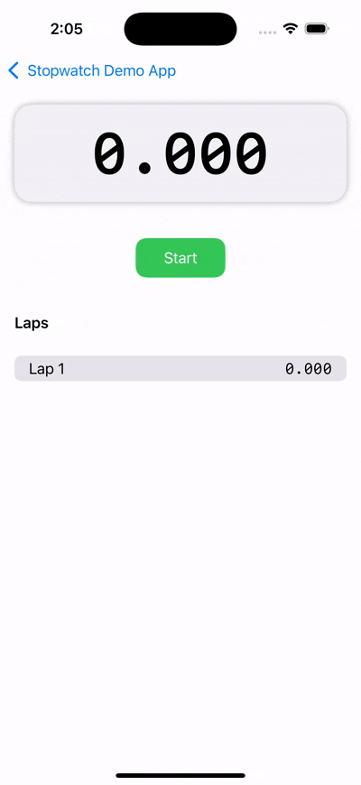
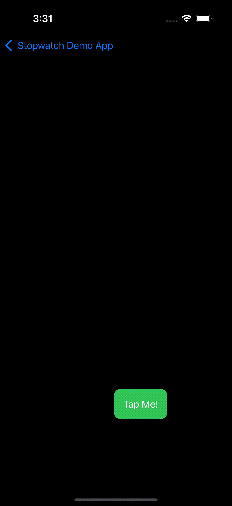

# Stopwatch

A lazily computed stopwatch with nanosecond precision.

## API

The public API is contained in the `Stopwatch()` actor.

### Variables

- `totalTimeElapsedInSeconds` - Total time that has elapsed in seconds. Not including time that the stopwatch was stopped
- `secondsElapsedThisLap` - Total time in seconds that have elapsed since the last lap. Not including time that the stopwatch was stopped
- `laps` - An array of seconds that elapsed in each lap
- `phase` - An enum of the current phase the stopwatch is in. Phase enum values include:
  - `ininitialized`: The stopwatch has been created or reset but hasn't started running
  - `running`: The stopwatch is measuring the elapsed time
  - `stopped`: The stopwatch was running and has now been stopped

### Functions

- `start()` - Starts the stopwatch and updates the stop watch phase to running
- `stop()` - Stops the stopwatch, calling `start` will resume
- `reset()` - Resets the stopwatch to its initial state, removing all laps.
- `lap()` - Adds a lap to the stopwatch. A lap is the elapsed time since the last recorded lap. If there is no laps then it is the total elapsed time.
- `poll()` - Returns an async stream outputting the seconds that have elapsed given by a duration passed in as a parameter. The default is set to 10ms.

## Demos

### Classic Stopwatch Demo

A classic stopwatch with lap counters.

### Simple Game Demo

A simple game to measure the users reflexes.

